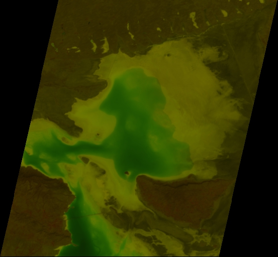
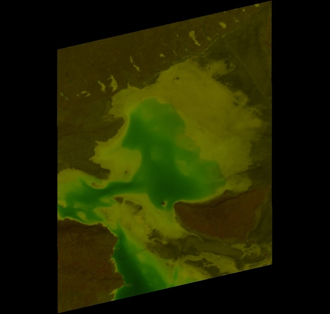

# Image-Rotation-Angle-Detection-with-Python
This code `rotationDetect.py` can to used to find the angle of rotation in an image. Especially, it has been designed for satellite data where geo-referencing rotates the image (as shown in images below).

```angle, rotated_list = getAngleofRotation(path, return_images=True, img_list=['<path>/img1.tif','<path>/img2.tif','<path>/img3.tif'])``` can be used to find the angle and rotate the image back to the straights. <br>

```angle = getAngleofRotation(path, return_images=False)``` will only compute the angle and return the float value. This setting can be used if one only needs the angle to be computed. It save processing time and memory space corresponding to the rotation on input image list.

## Results

### Original image
<div align='center'>

</div>


### Rotated image to align the image back to straight
<div align='center'>

</div>
